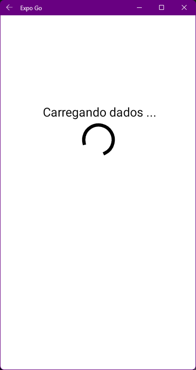

<h1 align="center"> Random Users 🎲</h1>

  
  

# Índices 🗂
* [Sobre](#sobre-)
* [Screenshots](#screenshots-)
* [Links](#links-)

# Sobre ☄
Projeto apenas para praticar um pouco o uso de API's e para ultilizar a biblioteca Modalize. A API ultilizada neste projeto foi a Random User Generator, que gera dados de usuários aleatoriamente.

# Screenshots 📸

    
    
    

# Links 🔗

* Random User Generator: [Documentação](https://randomuser.me)
* Modalize: [Repositório](https://github.com/jeremybarbet/react-native-modalize)

Criado por [Iago Amorim](https://github.com/danonep2).

